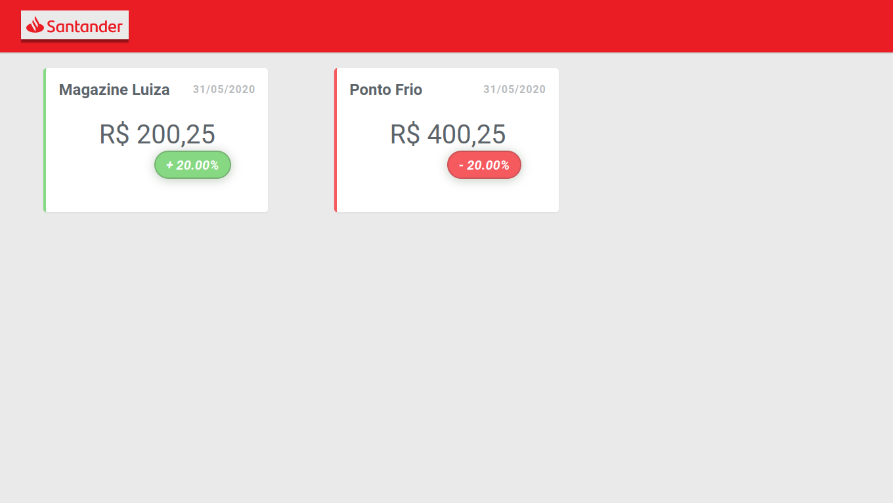

# Tela de cotações - Front-end Angular

> 🚀 Santader Dev Week 🚀

O projeto consiste em um sistema financeiro de cotação trazendo para a visualização dados vindo da API hospedada no heroku, neste repositório se encontra a parte front-end disponível no Github Pages, irei implementar as funcionalidades para POST, PUT, DELETE e GET com "today".

 

 

    
Links

<a href="https://lcds-cotacoes-santander.herokuapp.com/cotacoes/swagger-ui.html" target="_blank">API</a> 
<a href="https://lcds90.github.io/cotacoes-santander-ng/dashboard" target="_blank">Aplicação</a> 
<a href="https://github.com/lcds90/cotacoes-santander-java" target="_blank">Repositorio Back-End (Java)</a> 
<a href="https://github.com/lcds90/cotacoes-santander-ng" target="_blank">Repositorio Front-End (Angular)</a>

    
Resumo Módulo - Front-End

    

        

        O que é um componente?  
        Componentes são trechos de códigos separados onde você pode definir a responsabilidade de cada um separadando a aplicação em pequenos pedaços para fácil manunteção e responsabilidade.
        

        

        No angular é muito importante encapsular as páginas por contexto e uma funcionalidade que faz uso disso é separando a aplicação com criação de módulos.
        

        

        Com o sistema de rotas, é possível renderizar componentes específicos dependendo da rota utilizada.
        

    

